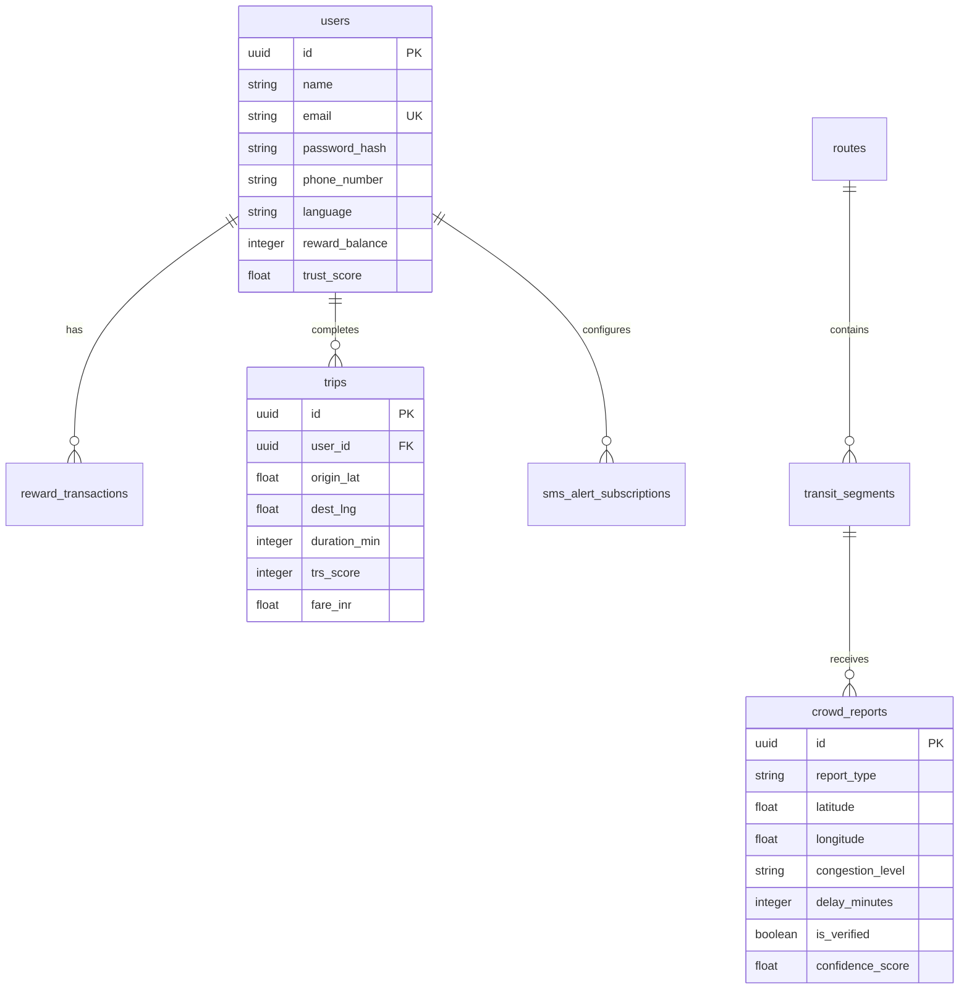

# 🗺️ Namma Transit — Civic Mobility Intelligence Platform

> **Version:** 1.0.0 (Revised Hackathon Edition)  
> **Tagline:** *Predict. Trust. Adapt.*  
> **Mission:** A commuter confidence platform that rebuilds trust in public transportation through prediction, community intelligence, and equitable access.

[](https://fastapi.tiangolo.com)
[](https://react.dev)
[](https://www.typescriptlang.org)
[](https://xgboost.ai)
[](https://redis.io)
[](https://maplibre.org)

---

## 📖 Table of Contents
1. [Project Overview & Core Pillars](#-project-overview--core-pillars)
2. [Tech Stack & Architecture](#-tech-stack--architecture)
3. [System Features & Walkthrough](#-system-features--walkthrough)
4. [API Endpoints Reference](#-api-endpoints-reference)
5. [Database Schema](#-database-schema)
6. [Local Environment Setup](#-local-environment-setup)
7. [React-to-Flutter Production Roadmap](#-react-to-flutter-production-roadmap)
8. [Known Limitations & Hackathon Stubs](#-known-limitations--hackathon-stubs)

---

## 🌟 Project Overview & Core Pillars

**Namma Transit** is a mobile-first civic mobility platform designed to rebuild trust in public transit for the Chennai metropolis. Instead of commuters treating transit as a daily guessing game, Namma Transit uses intelligence to supply reliable data, handle unexpected delays, and ensure equitable access across demographic and language boundaries.

### 🏛️ The Five Pillars of Commuter Trust

| Pillar | Mechanism | User Value |
| :--- | :--- | :--- |
| **🔮 Prediction** | XGBoost-powered Trip Reliability Score (TRS 0–100) | Commuters get granular, explainable metrics about route punctuality *before* boarding. |
| **👥 Community Intelligence** | Crowd Pulse passive telemetry network | Passengers anonymously supply delay and congestion info, verifying real-world conditions. |
| **📶 Equitable Access** | SMS subscription engine + IVR / USSD voice gateways | Feature-phone and offline users query routes, ETAs, and delay alerts over 2G network protocols. |
| **🧭 Adaptive Guidance** | Adaptive Last-Mile transfer risk engine | Dynamically tracks active multi-modal commutes and suggests alternatives for at-risk connections. |
| **🏆 Gamification** | Yatri Points rewards & contribution ranks | Commuters earn points for validating transit conditions, progressing from Newcomer to Community Champion. |

---

## 💻 Tech Stack & Architecture

### Backend Stack
* **Framework:** FastAPI (Python 3.11+) with Uvicorn ASGI server.
* **Database ORM:** SQLAlchemy 2.0 with GeoAlchemy2 (PostGIS geometry mapping).
* **Storage Engines:** Supabase PostgreSQL (Primary cloud store) + SQLite local file fallback (`fallback.db`) for zero-setup local development.
* **Intelligence Layer:** XGBoost 2.0.3 (reliability prediction) + Redis (sliding-window load tracking & congestion analytics).
* **Background Jobs:** APScheduler (cleanup of stale feeds & periodic model updates).

### Frontend Stack
* **Framework:** React 19.2 + TypeScript + Vite.
* **Routing & State:** TanStack Router (dynamic clientside routes) + TanStack Query / TanStack Start (caching and remote sync).
* **Mapping Engine:** MapLibre GL JS (configured for OpenFreeMap tiles; switches to Mapbox vector styles when a token is provided).
* **Visuals & Styling:** Tailwind CSS v4, shadcn/ui components (Radix UI base), Lucide icons, and Recharts.

---

## 🎨 System Features & Walkthrough

### 1. Home Map & Trust Dashboard
* **Dynamic Geocoding:** Features auto-complete geocoding via an in-memory cached Nominatim proxy to prevent OSM rate-limiting.
* **WebSocket vehicle stream:** Subscribes to live vehicle streams (`/vehicles/live/ws`), rendering active buses, metros, and commuter rail markers on the map with custom popups (speed, type, crowding).
* **Trust Dashboard:** A horizontally scrollable dashboard displaying live network health stats (Network Reliability Today, Active Reports, Transfer Success Rate, System Status).

### 2. Multi-Modal Route Planning & TRS Breakdown
* **Explainable TRS:** Returns route options graded from `Exceptional` down to `Avoid` using 14-feature reliability vectors.
* **Reliability Breakdown:** Click on any TRS score to view a 5-factor breakdown (Historical, Traffic, Transfer buffer, Crowd confidence, Overall score) derived directly from backend telemetry.
* **"Why Recommended?" Chips:** Highlights optimal routes using dynamic comparison chips (e.g., *Fastest*, *No Transfers*, *Low Crowding*).

### 3. Active Journey Navigation
* **3D Mode Map:** Centers on an eco-orange current location indicator pulsing along the route line with a 55° map pitch angle.
* **Connection Confidence Card:** Renders for multi-modal trips to calculate the real-time probability of missing a transfer. Displays delay estimates, trend indicators (Improving/Declining), and provides a **"Reroute Now"** option if risk becomes critical.

### 4. Crowd Pulse reporting
* **Validation Engine:** Submissions run through validation filters (GPS sanity checks, speed caps of 120 km/h, and a 30s duplicate rate limiter).
* **Community Impact Grid:** Renders real-time aggregate statistics from `/api/transit/crowd/stats` showing how reports have improved the network (active contributors, blind spots filled, routes improved).
* **Yatri Points Ledger:** Rewards verified crowd contributions (+50 points) and stores transaction history in the database.

### 5. Profile & Bilingual UI
* **i18n Translation Engine:** Complete bilingual localization (English / Tamil) containing over 115 keys per language.
* **Your Impact Grid:** Tracks lifetime trips, average reliability of routes taken, rank badges, and contribution milestones.
* **SMS Alert Console:** Simulates registering feature phones for real-time route alerts.

---

## 🔌 API Endpoints Reference

Base URL: `http://localhost:8000/api/transit` | Swagger Documentation: `http://localhost:8000/docs`

| Method | Endpoint | Description |
| :--- | :--- | :--- |
| `GET` | `/routes/plan` | Plan multi-modal route options between coordinates with TRS and breakdowns. |
| `GET` | `/stats/overview` | Fetch system-wide reliability statistics for the map dashboard. |
| `GET` | `/vehicles/live` | Retrieve live vehicle details (polled fallback). |
| `WS` | `/vehicles/live/ws` | Stream live vehicle positions over WebSockets filtered by bounding box. |
| `GET` | `/reliability/trs` | Get the Trip Reliability Score (TRS) for a specific route. |
| `GET` | `/reliability/transfer-risk` | Calculate transfer risk parameters for active multi-modal journeys. |
| `POST` | `/crowd/report` | Submit passenger feedback/telemetry (rate-limited to 10/min per IP). |
| `GET` | `/crowd/recent` | Fetch recent validated crowd reports. |
| `GET` | `/crowd/stats` | Fetch aggregate community crowd report stats. |
| `POST` | `/alerts/subscribe` | Register phone number for real-time SMS notifications. |
| `DELETE` | `/alerts/unsubscribe` | Cancel active SMS alerts for a phone number. |
| `GET` | `/search` | Nominatim proxy search for coordinates. |
| `GET` | `/voice/lookup` | Spoken ETA voice gateway for feature phones (IVR). |

---

## 🗄️ Database Schema

All database models are located in `Backend/app/db/models.py`.



---

## 🚀 Local Environment Setup

### 1. Clone & Core Structure
```bash
git clone https://github.com/navn2/Namma-Transit.git
cd Namma-Transit
```

### 2. Backend Setup
Make sure you have Python 3.11+ installed.
```bash
cd Backend

# Setup virtual environment
python -m venv .venv
# On Windows:
.venv\Scripts\activate
# On macOS/Linux:
source .venv/bin/activate

# Install dependencies
pip install -r requirements.txt

# Run development server
uvicorn main:app --reload --port 8000
```
*Note: If no Supabase connection URL is supplied in `Backend/.env`, the system automatically defaults to using the pre-seeded SQLite database file `fallback.db`.*

### 3. Frontend Setup
Make sure you have Node.js 18+ installed.
```bash
cd Frontend

# Install package dependencies
npm install

# Start Vite server
npm run dev
```
Open `http://localhost:5173` to interact with the platform.

---

## 📱 React-to-Flutter Production Roadmap

To scale Namma Transit to millions of daily Chennai commuters, the React prototype serves as a design blueprint for a high-performance native app built in Flutter. 

```
┌────────────────────────────────────────────────────────────────────────┐
│                        NAMMA TRANSIT ARCHITECTURE                      │
├───────────────────────────────────┬────────────────────────────────────┤
│           REACT (Demo)            │        FLUTTER (Production)        │
├───────────────────────────────────┼────────────────────────────────────┤
│ TanStack Router & URL Query       │ go_router / Navigator 2.0          │
│ TanStack Query (HTTP/WS)          │ Dio client + Riverpod state        │
│ MapLibre GL (OpenFreeMap)         │ Mapbox Flutter SDK (Offline tiles) │
│ Tailwind CSS v4                   │ Custom Material 3 Dart Theme       │
│ Custom i18n JSON                  │ Flutter intl (.arb translation)    │
└───────────────────────────────────┴────────────────────────────────────┘
```

The underlying API endpoints, WebSocket models, and database contracts are built framework-agnostic to support this migration.

---

## 🛠️ Known Limitations & Hackathon Stubs

* **XGBoost Predictor:** Relies on a rule-based deterministic fallback (`_rule_based_trs()`) mirroring the trained formula when the model weights file (`models/trs_xgboost_v1.json`) is not generated.
* **SMS, IVR & USSD Gateways:** Gateway pipelines are fully modeled as state machines and database schemas, but stubbed out. Activating them requires configuring Twilio/Exotel credentials and establishing telecommunications trunk lines.
* **Live Vehicles:** Vehicle telemetry updates via a simulated loop reflecting live transit schedules over WebSockets.
